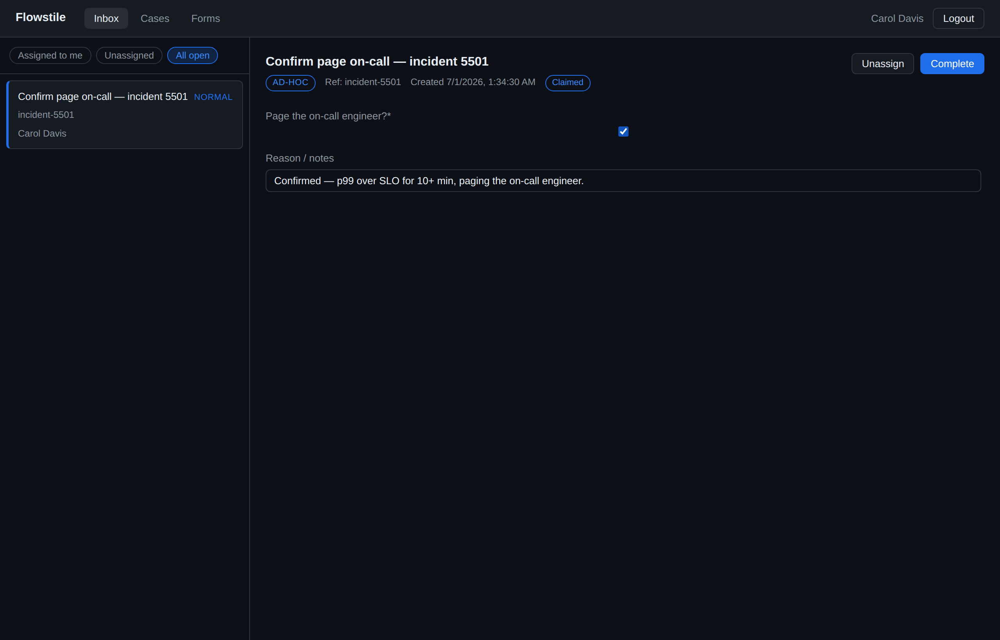
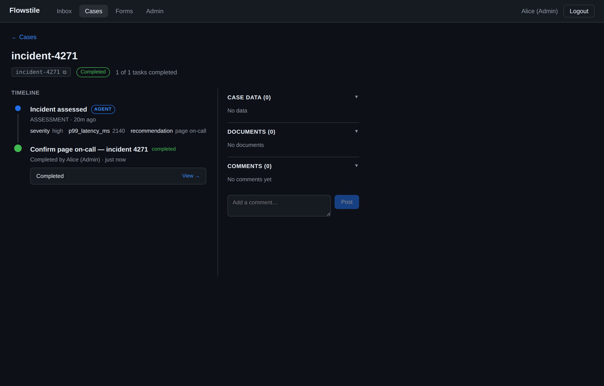

# Ad-Hoc Tasks with Inline Forms

Most Flowstile tasks bind to a **published form**: the workflow names a task
definition, Flowstile looks up the latest published form for it, locks the
version onto the task, and validates the human's submission against that locked
schema. That path is governed — versioned, field-visibility-aware, draft/publish
gated — and it is the **recommended default**.

Sometimes a workflow needs a human task that **didn't exist when the process was
authored**. An agent inspects a case mid-run, decides it needs a specific
confirmation, and *generates the form for it on the spot*. There is no published
form to point at, because the question only became clear at runtime.

An **ad-hoc task** covers that case: the workflow supplies the form's JSON Schema
**inline**, at task-creation time, and Flowstile validates the submission against
*that* schema instead of a published version.

> **This is an opt-in escape hatch, not the default.** An inline form has **no
> version locking, no field-level visibility rules, no draft/publish gate, and no
> declarative outcomes**. Reach for it only when the form is genuinely emergent.
> When you can name the form ahead of time, use a published form. See the
> "[runtime-emergent human tasks](./design-decisions.md#runtime-emergent-human-tasks-inline-forms-and-chat-proposed)"
> ladder in the design notes for where this sits.

## When to use it

| Use an ad-hoc inline form when… | Use a published form when… |
|---|---|
| An agent/step decides *at runtime* what to ask | The form is known when you author the process |
| The form is single-use and emergent | The form is reused across instances |
| You don't need versioning or field visibility | You need version locking, `visibilityRules`, outcomes, or the designer |

What you still get with an ad-hoc task — unchanged from any other task:

- **Need-to-know visibility.** `candidateUsers` / `candidateGroups` (or an
  assignee) still scope who can see and act on the task. An ad-hoc task with no
  candidates and no assignee is oversight-only, exactly like any other task.
- **The full lifecycle.** created → claim → complete (or cancel), with the same
  state machine and the same completion signal back to your workflow.
- **Typed results.** Pass an output model and `result.data` is validated and
  typed, just like a published-form task.

## Python

`create_task_and_wait` gains a `form_schema` (and optional `ui_schema`, `name`)
keyword. Provide it *instead of* a task definition — no `task_definition_id`, no
`task_definition_code`.

The agent that generates the schema runs in an **ordinary Temporal activity**
(not the workflow), so the workflow stays deterministic and the workflow module
stays sandbox-clean.

```python
from datetime import timedelta
from temporalio import workflow
from pydantic import BaseModel

from flowstile import FlowstileWorkflowBase


class TriageDecision(BaseModel):
    approved: bool
    reason: str | None = None


@workflow.defn
class IncidentTriageWorkflow(FlowstileWorkflowBase):
    @workflow.run
    async def run(self, incident: dict) -> dict:
        # An agent step (a Temporal activity that calls your LLM) inspects the
        # incident and decides what it needs a human to confirm — returning a
        # one-off JSON Schema for the form.
        plan = await workflow.execute_activity(
            assess_incident,
            incident,
            start_to_close_timeout=timedelta(minutes=2),
        )

        # Record what the agent did, on the case timeline (audit) — see the
        # case-event log. The inline form raises the task; the event log records
        # the reasoning that led to it.
        await self.record_case_event(
            incident["id"],
            actor="agent",
            label="Incident assessed",
            payload={
                "severity": plan["severity"],
                "recommendation": plan["recommendation"],
            },
        )

        # Raise a one-off human task carrying the agent's inline form.
        result = await self.create_task_and_wait(
            output=TriageDecision,
            form_schema=plan["form_schema"],
            ui_schema=plan.get("ui_schema"),
            name=f"Confirm {plan['recommendation']} — incident {incident['id']}",
            process_instance_id=incident["id"],
            context_data={"summary": plan["summary"], "severity": plan["severity"]},
            candidate_groups=["incident-responders"],
        )

        return {"approved": result.data.approved, "reason": result.data.reason}
```

Where `assess_incident` is your own activity. A minimal hand-built schema (no LLM)
makes the shape concrete:

```python
plan = {
    "severity": "high",
    "recommendation": "page on-call",
    "summary": "DB latency p99 over 2s for 10 min on orders-db.",
    "form_schema": {
        "type": "object",
        "properties": {
            "approved": {"type": "boolean", "title": "Page the on-call engineer?"},
            "reason": {"type": "string", "title": "Reason / notes"},
        },
        "required": ["approved"],
    },
}
```

`result.data` is a validated `TriageDecision`. Drop `output=` to get a plain
`dict` back instead.

## TypeScript

`createTaskAndWait` gains the same `formSchema` / `uiSchema` / `name` fields.

```typescript
import { createTaskAndWait } from '@flowstile/sdk/workflows';
import { proxyActivities } from '@temporalio/workflow';
import type * as activities from './activities';

const { assessIncident } = proxyActivities<typeof activities>({
  startToCloseTimeout: '2 minutes',
});

export async function incidentTriage(incident: Incident): Promise<Decision> {
  const plan = await assessIncident(incident);

  const result = await createTaskAndWait<{ approved: boolean; reason?: string }>({
    formSchema: plan.formSchema,
    uiSchema: plan.uiSchema, // optional
    name: `Confirm ${plan.recommendation} — incident ${incident.id}`,
    processInstanceId: incident.id,
    contextData: { summary: plan.summary, severity: plan.severity },
    candidateGroups: ['incident-responders'],
  });

  return { approved: result.data.approved, reason: result.data.reason };
}
```

## In the inbox

An ad-hoc task appears in the inbox like any other. Its inline schema is rendered
by the same JSON Forms renderer that draws published forms, so it looks and
behaves identically to a normal task — claim, fill, complete. The only visible
difference is an **"Ad-hoc"** badge (there is no form code/version to show) and
the `name` you gave it as the task title.



On the case timeline, the agent step that generated the form shows up as an
`agent` event, so the emergent task is auditable end to end — the reasoning and
the resulting human decision side by side.



## API reference

### Creating an ad-hoc task

`POST /tasks` accepts an inline `formSchema` **instead of** a task definition:

```http
POST /tasks
Content-Type: application/json

{
  "workflowId": "incident-triage-42",
  "processInstanceId": "incident-42",
  "formSchema": {
    "type": "object",
    "properties": {
      "approved": { "type": "boolean" },
      "reason": { "type": "string" }
    },
    "required": ["approved"]
  },
  "uiSchema": { },
  "name": "Confirm page on-call — incident 42",
  "candidateGroups": ["incident-responders"],
  "contextData": { "summary": "..." }
}
```

Rules:

- **Provide exactly one of** `taskDefinitionId`, `taskDefinitionCode`, **or**
  `formSchema`. (Supplying a task definition *and* a `formSchema` is a `400`.)
- `uiSchema` and `name` are optional and only meaningful alongside `formSchema`.
- An ad-hoc task has **no task definition** and **no locked form version**
  (`formDefinitionVersion` is `null`). `candidateUsers` / `candidateGroups` are
  taken directly from the request — there is no task definition to inherit from.
- If `inputData` is provided, it is validated leniently (no `required`
  enforcement) against the inline `formSchema`, the same as for a published form.

### Completing an ad-hoc task

`POST /tasks/:id/complete` is unchanged. The submitted `data` is validated
against the task's **inline** `formSchema` (the same AJV pipeline used for
published forms), with the same ordering — the state-machine check returns `409`
before any `422` for invalid data.

### Reading an ad-hoc task

`GET /tasks/:id` embeds the inline schema in the same `form` envelope as a
published-form task, with `code` and `version` set to `null`:

```json
{
  "id": "…",
  "name": "Confirm page on-call — incident 42",
  "form": {
    "code": null,
    "version": null,
    "jsonSchema": { "type": "object", "properties": { "…": {} } },
    "uiSchema": {},
    "formMessages": {},
    "outcomes": null,
    "outcomeKey": null
  },
  "contextData": { "summary": "…" }
}
```

Because the schema lives on the task, the client renders an ad-hoc form with no
extra round-trip — exactly as it does for a published form.

## What an inline form deliberately does not have

These are governance features of **published** forms, intentionally absent from
ad-hoc inline forms. If you need any of them, author a published form instead:

- **No version locking.** The schema is the one supplied at creation; there is no
  version history and nothing to re-bind.
- **No field-level visibility rules.** `visibilityRules` filtering does not apply,
  so every field in the inline schema is delivered to everyone who can see the
  task. (Instance-level need-to-know still applies — *who* sees the task — just not
  *which fields*.)
- **No declarative outcomes.** No outcome buttons / `requireFields` enforcement;
  model decisions as ordinary schema fields (e.g. an `approved` boolean or a
  `decision` enum).
- **No draft/publish gate.** The form is never reviewed or published; the workflow
  author (or its agent) is fully responsible for the schema it raises.
