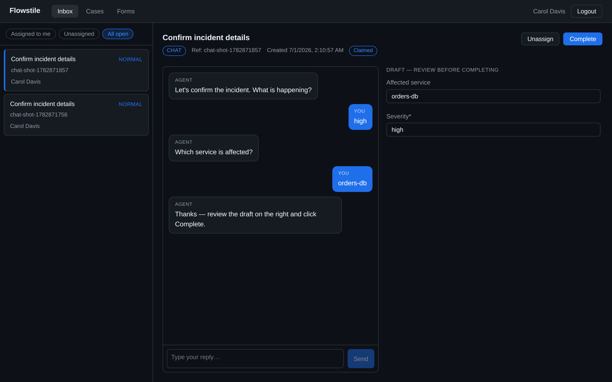

# Chat Tasks (Conversational Forms)

> **Status: design direction, pass 1 — not built yet.** This is rung 4 of the
> [runtime-emergent ladder](./design-decisions.md#runtime-emergent-human-tasks-inline-forms-and-chat-proposed).
> It builds on [ad-hoc inline forms](./ad-hoc-tasks.md) (rung 3). Rung 5 (the agent
> renders mini-forms *inside* the chat) is the next increment, sketched at the end.

A normal task shows a form; the human types into fields and submits. A **chat
task** replaces the *typing* with a **conversation**: an agent asks for what it
needs, the human answers in natural language, and the agent fills in the
structured data behind the scenes. When the data is complete, **the human
reviews and commits it** — a normal task completion.

The key idea: **chat is just a different elicitation surface over the same form
contract.** The task still targets a form (published or inline), still validates
`submissionData` against that schema, still completes with one typed payload, and
the workflow still learns the result through the same completion signal. Nothing
about the durable contract changes — only *how the fields get filled*.

## The model: agent assists, human commits

This is the load-bearing decision, and it keeps chat consistent with Flowstile's
principles (see [design-decisions](./design-decisions.md)):

- **The agent gathers; it does not complete.** The agent converses and maintains
  a **draft** `submissionData`, extracting structure from the conversation. It
  never completes the task. Completion stays a human act, so `completedBy` is a
  real person and the audit trail is honest — the same reason the SDK never
  completes tasks.
- **The human commits.** The inbox shows the live chat **and** the draft filling
  in. When satisfied, the human clicks **Complete** — ordinary completion,
  validated against the form schema exactly as today.
- **The workflow is unchanged.** It calls `create_task_and_wait(...)` and blocks
  on the same completion signal. The whole conversation happens *below* the task,
  invisible to the workflow. The task's lifetime simply spans the chat.

```
workflow ──create_task_and_wait──► [ chat task: goal + target schema ]
                                          │
                    ┌─────────────────────┴─────────────────────┐
                    │  human ⇄ agent conversation (below task)   │
                    │  agent maintains draft submissionData      │
                    └─────────────────────┬─────────────────────┘
                                          │  human clicks Complete
workflow ◄──completion signal (data)──────┘
```

## Where the agent runs (bring-your-own, never the server)

The agent is **your** code, running in **your** infrastructure — exactly like the
Temporal worker. Flowstile never calls an LLM itself; there is no vendor-AI
dependency baked into the server (the same BYO posture as everything else).

An **agent handler** watches for chat tasks that have an unanswered human message,
produces the next reply, and updates the draft. For the demo and the e2e test this
is a **deterministic, scripted handler** (no external model, so CI stays hermetic);
in production it is a thin loop around the LLM of your choice.

- **Transport is plain REST** (post a message, poll the transcript) for v1 —
  simple and CI-friendly. A streaming/WebSocket transport is a later optimization,
  not a contract change.
- **The transcript lives on the server** (`task_messages`), so the inbox can render
  it and it is auditable. This is separate from the [case-event log](./design-decisions.md#surfacing-automated-and-agent-work-a-case-event-log-shipped--additive-tier),
  which stays the *curated business* timeline; the transcript is the *raw*
  conversation.

## Python

A chat task is a normal task plus a `chat` config (a goal + the agent handler
name). The target shape is the usual form — a published `task_definition_code` or
an inline `form_schema`.

```python
from temporalio import workflow
from pydantic import BaseModel

from flowstile import FlowstileWorkflowBase, Chat


class IncidentReport(BaseModel):
    severity: str
    service: str
    page_on_call: bool


@workflow.defn
class IncidentIntakeWorkflow(FlowstileWorkflowBase):
    @workflow.run
    async def run(self, incident: dict) -> dict:
        result = await self.create_task_and_wait(
            output=IncidentReport,
            # The target structured shape — reuse an inline schema (or a published form).
            form_schema=IncidentReport.model_json_schema(),
            # Elicit it by conversation instead of a blank form.
            chat=Chat(
                agent="incident-intake",  # names YOUR handler (below)
                goal="Collect the severity, affected service, and whether to page "
                     "the on-call engineer. Ask one question at a time.",
                greeting="Hi — let's triage this incident. What's happening?",
            ),
            process_instance_id=incident["id"],
            context_data={"raw_alert": incident["alert"]},
            candidate_groups=["incident-responders"],
        )
        return {"severity": result.data.severity, "page": result.data.page_on_call}
```

`result.data` is a validated `IncidentReport` — the same typed result as any task.
The workflow neither sees nor drives the conversation.

### The agent handler (deterministic demo; real LLM in production)

The handler receives the transcript + current draft and returns the next agent
message and an updated draft. The demo/e2e version is fully scripted so it is
reproducible; a production handler swaps the body for an LLM call.

```python
from flowstile import agent_handler, AgentTurn, AgentReply

@agent_handler("incident-intake")
def incident_intake(turn: AgentTurn) -> AgentReply:
    draft = dict(turn.draft)
    last = turn.last_human_message  # None on the first turn

    # Deterministic scripted flow (production: one LLM call that fills `draft`
    # and writes the next question).
    if "severity" not in draft and last:
        draft["severity"] = last.lower()
        return AgentReply("Which service is affected?", draft=draft)
    if "service" not in draft and last:
        draft["service"] = last
        return AgentReply("Should I page the on-call engineer? (yes/no)", draft=draft)
    if "page_on_call" not in draft and last:
        draft["page_on_call"] = last.strip().lower().startswith("y")
        return AgentReply(
            "Thanks — I've filled in severity, service, and the page decision. "
            "Review on the right and click Complete when it looks right.",
            draft=draft,
        )
    return AgentReply("What's the severity — low, medium, or high?", draft=draft)
```

Register handlers on the worker alongside your activities; the handler runs in
your infrastructure and talks to Flowstile over the REST endpoints below.

## In the inbox

A chat task renders a **conversation panel** on the left and the **draft form** on
the right. The human types replies; the agent's questions and the draft fields
appear as the exchange proceeds. The **Complete** button commits the draft — the
same completion, validation, and signal as any task. A **"Chat"** badge marks it.



The conversation is recorded, so the case remains auditable end to end — the
questions asked, the human's answers, and the committed result.

## API reference

A chat task is created like any task, with an added `chat` object; it also gains
a message sub-resource.

### Creating a chat task

`POST /tasks` accepts a `chat` object alongside a form source (`taskDefinitionId`
/ `taskDefinitionCode` / `formSchema`):

```http
POST /tasks
{
  "workflowId": "...",
  "processInstanceId": "incident-42",
  "formSchema": { "type": "object", "properties": { "...": {} } },
  "chat": {
    "agent": "incident-intake",
    "goal": "Collect severity, service, page decision.",
    "greeting": "Hi — let's triage this incident. What's happening?"
  },
  "candidateGroups": ["incident-responders"]
}
```

### Messages (the transcript)

- `GET /tasks/:id/messages` → `{ items: [{ id, role, content, createdAt }] }`.
  `role` is `human` | `agent`. Visible to anyone who can see the task.
- `POST /tasks/:id/messages` `{ content }` → append a message. A human posts via
  the UI (role inferred from the caller); the agent handler posts with a service
  credential (role `agent`).

### Draft submission

- `PATCH /tasks/:id/submission` `{ data }` — the agent updates the draft
  `submissionData` as it extracts structure. Merged, **not** validated on the way
  in (the draft may be partial); validation happens at completion, unchanged.

### Completing

`POST /tasks/:id/complete` is **unchanged** — the human commits the draft (or an
edited version of it), validated against the form schema, 409-before-422 as always.
The agent never calls this endpoint.

## What this deliberately is *not*

- **The agent does not complete the task.** Autonomous agent completion was
  rejected: it would forge `completedBy` and break the human-accountability
  boundary. Chat *fills* the form; a human *commits* it.
- **No new durable contract.** `submissionData`, form validation, the completion
  signal, and need-to-know visibility are all unchanged. Chat is an elicitation
  surface, not a new task type at the workflow layer.
- **Not governed like a published form's fields.** As with inline forms, the
  conversation itself has no field-visibility rules; the target *schema* still
  governs the committed data.

## Next increment — rung 5 (mini-forms in the chat)

Once chat exists, the agent can post a **structured mini-form as a message**
instead of a plain question — "confirm these three line items," "pick a date" —
reusing rung 3's inline `formSchema` as the payload of a chat turn. The human fills
it inline, it becomes the next answer, the conversation continues. That is purely
additive to what this doc describes (a message may carry a `formSchema`), which is
why chat-as-form comes first.
